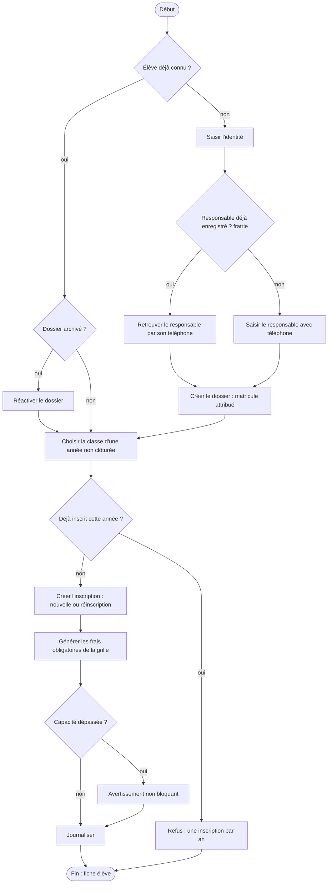
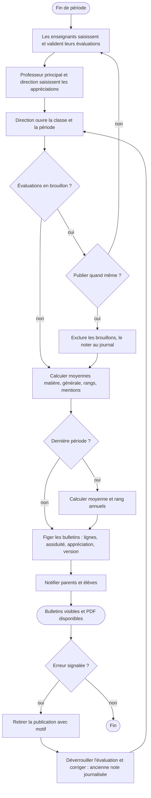
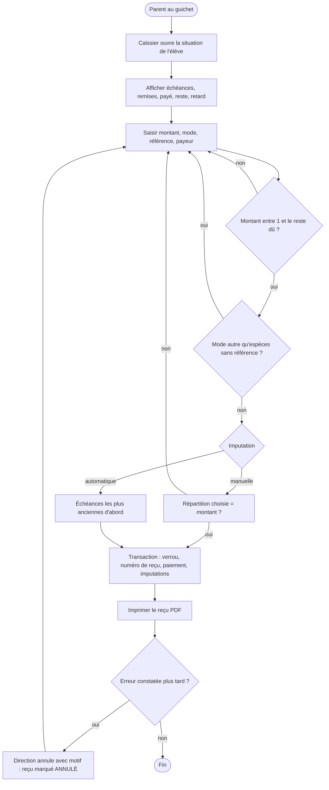
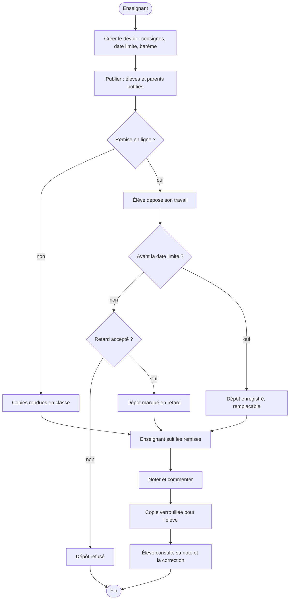

# 5. Diagrammes d'activité

## 5.1 Inscription d'un élève

```mermaid
flowchart TD
    A([Début]) --> B{Élève déjà connu ?}
    B -- non --> C[Saisir l'identité]
    C --> D{Responsable déjà enregistré ? fratrie}
    D -- oui --> E[Retrouver le responsable par son téléphone]
    D -- non --> F[Saisir le responsable avec téléphone]
    E --> G[Créer le dossier : matricule attribué]
    F --> G
    B -- oui --> H{Dossier archivé ?}
    H -- oui --> I[Réactiver le dossier] --> J
    H -- non --> J[Choisir la classe d'une année non clôturée]
    G --> J
    J --> K{Déjà inscrit cette année ?}
    K -- oui --> X[Refus : une inscription par an]
    K -- non --> L[Créer l'inscription : nouvelle ou réinscription]
    L --> M[Générer les frais obligatoires de la grille]
    M --> N{Capacité dépassée ?}
    N -- oui --> O[Avertissement non bloquant]
    N -- non --> P
    O --> P[Journaliser]
    P --> Q([Fin : fiche élève])
    X --> Q
```

## 5.2 Génération d'un bulletin

```mermaid
flowchart TD
    A([Fin de période]) --> B[Les enseignants saisissent et valident leurs évaluations]
    B --> C[Professeur principal et direction saisissent les appréciations]
    C --> D[Direction ouvre la classe et la période]
    D --> E{Évaluations en brouillon ?}
    E -- oui --> F{Publier quand même ?}
    F -- non --> B
    F -- oui --> G[Exclure les brouillons, le noter au journal]
    E -- non --> H
    G --> H[Calculer moyennes matière, générale, rangs, mentions]
    H --> I{Dernière période ?}
    I -- oui --> J[Calculer moyenne et rang annuels]
    I -- non --> K
    J --> K[Figer les bulletins : lignes, assiduité, appréciation, version]
    K --> L[Notifier parents et élèves]
    L --> M([Bulletins visibles et PDF disponibles])
    M --> N{Erreur signalée ?}
    N -- oui --> O[Retirer la publication avec motif]
    O --> P[Déverrouiller l'évaluation et corriger : ancienne note journalisée]
    P --> D
    N -- non --> Z([Fin])
```

## 5.3 Paiement des frais

```mermaid
flowchart TD
    A([Parent au guichet]) --> B[Caissier ouvre la situation de l'élève]
    B --> C[Afficher échéances, remises, payé, reste, retard]
    C --> D[Saisir montant, mode, référence, payeur]
    D --> E{Montant entre 1 et le reste dû ?}
    E -- non --> D
    E -- oui --> F{Mode autre qu'espèces sans référence ?}
    F -- oui --> D
    F -- non --> G{Imputation}
    G -- automatique --> H[Échéances les plus anciennes d'abord]
    G -- manuelle --> I[Répartition choisie = montant ?]
    I -- non --> D
    I -- oui --> J
    H --> J[Transaction : verrou, numéro de reçu, paiement, imputations]
    J --> K[Imprimer le reçu PDF]
    K --> L{Erreur constatée plus tard ?}
    L -- oui --> M[Direction annule avec motif : reçu marqué ANNULÉ]
    M --> D
    L -- non --> N([Fin])
```

## 5.4 Remise et correction d'un devoir

```mermaid
flowchart TD
    A([Enseignant]) --> B[Créer le devoir : consignes, date limite, barème]
    B --> C[Publier : élèves et parents notifiés]
    C --> D{Remise en ligne ?}
    D -- non --> P[Copies rendues en classe]
    D -- oui --> E[Élève dépose son travail]
    E --> F{Avant la date limite ?}
    F -- non --> G{Retard accepté ?}
    G -- non --> H[Dépôt refusé]
    G -- oui --> I[Dépôt marqué en retard]
    F -- oui --> J[Dépôt enregistré, remplaçable]
    I --> K
    J --> K[Enseignant suit les remises]
    P --> K
    K --> L[Noter et commenter]
    L --> M[Copie verrouillée pour l'élève]
    M --> N[Élève consulte sa note et la correction]
    N --> Z([Fin])
    H --> Z
```
